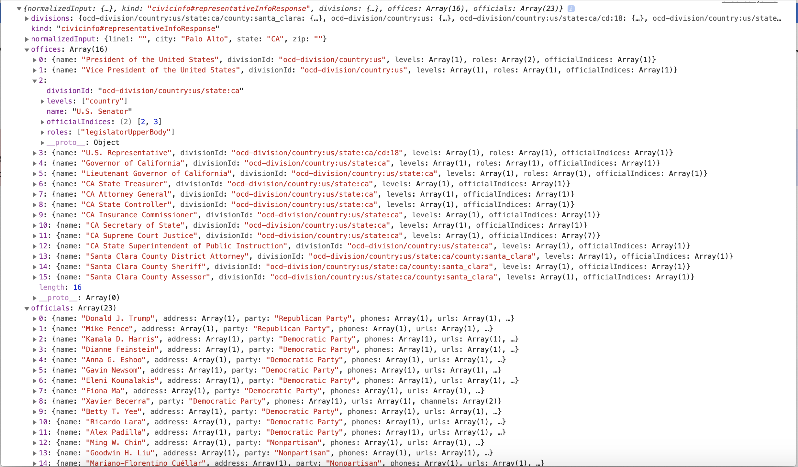
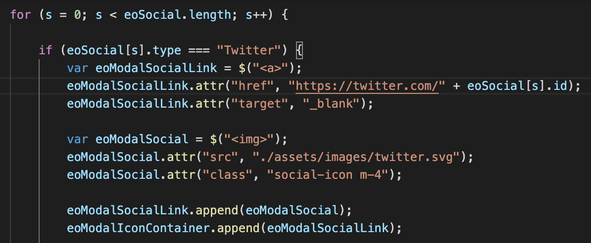

# CONNECTED POLITICS

## Description
Create an application that uses two or more API's, AJAX to pull the data from it, at least one new library or technology that hasn't been discussed in class, and have a polished front end/UI. Also the project must meet good quality coding standards, not use any alerts, confirms, or prompts, have a repeating element, a CSS framework other than Bootstrap, must be deployed, have User Input Validation, must be interactive, and have some repeating element/table. 

We created an application that uses a pro publica API to pull pending legislation that is about to be voted on by our elected officials and a google civil information API to pull the federal, state, and local elected officials from a user's address with a search function on the app. We chose Bulma as our CSS framework because it is adaptive to AJAX created cards and columns and looks great. We used typed.js to give the application more visual appealing and we didnt't use any prompts, confirms, or alerts.


## Built With
- HTML
- CSS
- Javascript
- jQuery
- AJAX
- [Bulma CSS](https://www.bulma.io)
- [Typed.js](https://github.com/mattboldt/typed.js/blob/master/README.md)
- [Google Civil Information API](https://developers.google.com/civic-information)
- [ProPublica API](https://projects.propublica.org/api-docs/congress-api/bills/)
- [Baloon CSS](https://kazzkiq.github.io/balloon.css/)

## How to Use this Application
Simply type your address in the search bar and you will be able to find out who your Federal, State, and Local representatives are! Click on the upcoming bills button and you will be able to check out all of the pending legislation that your elected officials will be voting on! Click on the scoial media icons to share your opinion! [Check it out for yourself!](https://anusontarangkul.github.io/connected-politics/)

## What makes this project stand out?
This is our first project of the bootcamp. Although we had a general direction for the project we had the freedom to make what we wanted. The choice to decide was up to us. We spent time talking about what we would like to make and if we could make it. In the end we set a minimum viable product as the base and set out layers to add to that MVP as we progressed. Having the responsibility to decide what and how we will make is what really set this project aside from anything we have worked on so far. 

This app also differes from anything out there right now beacuse it gives users the ability to find their Federal, State, and Local representatives but also reach out to them through social media! Users also have the abillity to find upcoming legislation and share it through social media as well!

## How it works! 

### Propublica API

### Google Civic Information API

The google Civic Information API is a straight forward API to use! It gives you the option to find out any upcoming elections and who your elected officials are by entering your address. We utilized the latter function of the API. The general structure of the AJAX response easy enough to understand. What got interesting was how we had to interact with the data in order to utilize the information in a way that made sense with our users. 



In the example above you'll notice that the two main sub sections of information come form .officals and .offices. They are both an aray of objects. some of those objects having arrays themselves. One of those being the offices[2].officialIndecies. This is the main array that connects offices to officials. It was fun to connect the data from both objects. To do this we leveraged the power of nested For Loops! In the example below we will walk you through the code used to append social media icons to each elected officials corrosponding modal. 

```
for (i = 0; i < r.offices.length; i++) {

            if (natLVL === true && (r.offices[i].name.includes("President") || r.offices[i].name.includes("U.S."))) {
                getEOinfo();
            } else if (stateLVL === true && (r.offices[i].name.includes(address.state) || r.offices[i].name.includes("Governor"))) {
                getEOinfo();
            } else if (localLVL === true && !r.offices[i].name.includes(address.state) && !r.offices[i].name.includes("Governor") && !r.offices[i].name.includes("U.S.") && !r.offices[i].name.includes("President")) {
                getEOinfo();
            }
        };
```
The code above allowed us to iterate through each office and filter the choices we displayed by comparing the string they .title included.

```
    for (j = 0; j < office[i].officialIndices.length; j++) {
        var eoInfo = elected[office[i].officialIndices[j]];

        var eoTitle = office[i].name;
        var eoName = eoInfo.name;
        var eoParty = eoInfo.party;
        var eoPhoto = eoInfo.photoUrl;
        var eoNumber = eoInfo.phones[0];
        var eoEmail = eoInfo.emails;
        var eoSocial = eoInfo.channels;
        var eoWebsite = eoInfo.urls;

```

The code above allowed us to iterate through each person within each office title in order to get desired information. The reason for this loop is to iterate through the elected officials that share title such as U.S. Senators and City Council Members. 

```
if (eoSocial !== undefined) {

            var ytCount = 0;

            for (s = 0; s < eoSocial.length; s++) {

                if (eoSocial[s].type === "Twitter") {
                    var eoModalSocialLink = $("<a>");
                    eoModalSocialLink.attr("href", "https://twitter.com/" + eoSocial[s].id);
                    eoModalSocialLink.attr("target", "_blank");

                    var eoModalSocial = $("");
                    eoModalSocial.attr("src", "./assets/images/twitter.svg");
                    eoModalSocial.attr("class", "social-icon m-4");

                    eoModalSocialLink.append(eoModalSocial);
                    eoModalIconContainer.append(eoModalSocialLink);

                } else if (eoSocial[s].type === "Facebook") {
                    var eoModalSocialLink = $("<a>");
                    eoModalSocialLink.attr("href", "https://www.facebook.com/" + eoSocial[s].id);
                    eoModalSocialLink.attr("target", "_blank");

                    var eoModalSocial = $("");
                    eoModalSocial.attr("src", "./assets/images/facebook.svg");
                    eoModalSocial.attr("class", "social-icon m-4");

                    eoModalSocialLink.append(eoModalSocial);
                    eoModalIconContainer.append(eoModalSocialLink);

                } else if (eoSocial[s].type === "YouTube" && ytCount === 0) {
                    var eoModalSocialLink = $("<a>");
                    eoModalSocialLink.attr("href", "https://www.youtube.com/" + eoSocial[s].id);
                    eoModalSocialLink.attr("target", "_blank");

                    var eoModalSocial = $("");
                    eoModalSocial.attr("src", "./assets/images/youtube.svg");
                    eoModalSocial.attr("class", "social-icon m-4");

                    eoModalSocialLink.append(eoModalSocial);
                    eoModalIconContainer.append(eoModalSocialLink);

                    ytCount++;
                };
            };
        };
```
This last section of code really encompases the code dynamic of how we interacted with the google API. We had to use a series of if else statements keep the code from breaking if any of the elected officials happen to be missing information. We relyed a lot on string values to determin what the javascript should do during in a given loop. 

Here is an example of how a modal can differ in the amount of information between elected officials: 


### Social Media Highlights
Here we used a for loop to find the social media tags is the google civic API and add them to the social media link with an 'a' tag, src, and class. We used 'if else' statements in the rest of the for loop for the other social media tags in the API.



## Authors

### David Anusontarangkul
- https://github.com/anusontarangkul
- https://www.linkedin.com/in/anusontarangkul/

### Jonathan-David Martinez
- https://github.com/Goodlvn
- https://www.linkedin.com/in/jonathan-martinez-316406113/

### Ry Hull
 - https://github.com/ryandelonhull
 - linkedin.com/in/ryan-hull-94003144

 ## *Acknowledgments*
 Thank you to Roger, Kerwin, and Manuel for having us ready to take on a project like this. 
